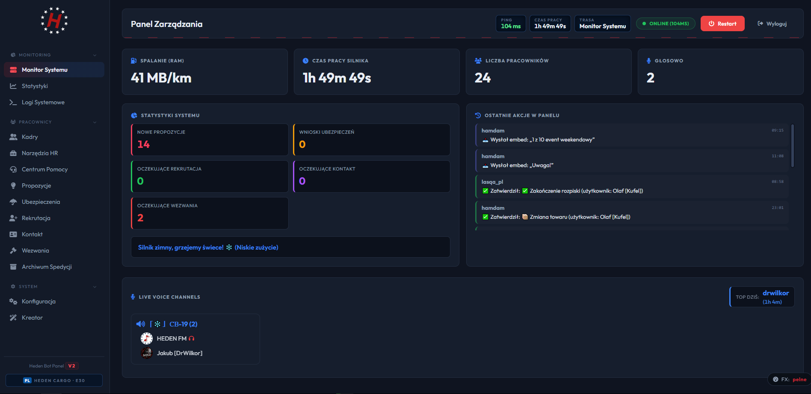

<div align="center">

# 🚚 HEDEN Cargo Web - Platforma Spedycyjna

[](https://nodejs.org/)
[](https://discord.js.org/)
[](https://www.mongodb.com/)
[](https://expressjs.com/)

[](https://discord.com/users/446740090757316608)
[](#-licencja)

<br>

### 🌐 Kompleksowa platforma spedycyjna HEDEN Cargo - panel Zarządu (WWW) + zaawansowany bot Discord

<br>

[🌐 Panel WWW](#-panel-zarządzania-www) •
[🔗 Express API](#-express-api-bridge) •
[🤖 Discord Bot](#-discord-bot) •
[📸 Screenshots](#-screenshots) •
[🛠️ Technologie](#️-technologie) •
[📞 Kontakt](#-kontakt)

<br>

---

</div>

<br>

## 🌐 Panel Zarządzania WWW

### 🖥️ Web Dashboard do zarządzania botem i serwerem Discord

Nowoczesny panel administracyjny z logowaniem przez Discord OAuth2 — dostęp wyłącznie dla Zarządu firmy, bezpieczne sesje i chronione API. Panelem zarządza się całym systemem HEDEN Cargo:

#### 🛡️ Panel Administratora
- ✅ **Monitor Systemu** - Spalanie (RAM), czas pracy, liczba pracowników, aktywność głosowa na żywo
- ✅ **HUD w stylu ETS** - Ping bota, uptime i aktualna sekcja jak na desce rozdzielczej ciężarówki
- ✅ **Live Voice Channels** - Podgląd kto aktualnie siedzi na kanałach głosowych + Top czas dnia
- ✅ **Logi Systemowe** - Podgląd logów z pamięci procesu + pobieranie plików logów
- ✅ **Restart bota** - Bezpieczny restart procesu wprost z panelu
- ✅ **Konfiguracja bota** - 7 zakładek: Statusy, Wygląd embedów, Kanały, Role, Moduły, Emoji (upload własnych), Panele

#### 🎯 Zarządzanie Zleceniami
- ✅ **Ubezpieczenia** - Panel akceptacji/odrzucania wniosków ubezpieczeniowych z modalem powodu odmowy
- ✅ **Archiwum Spedycji** - Pełna historia rozstrzygniętych wniosków z filtrami i usuwaniem
- ✅ **Rekrutacja** - Kolejka zgłoszeń rekrutacyjnych z akceptacją i odrzuceniem
- ✅ **Kontakt z Zarządem** - Obsługa zgłoszeń kontaktowych pracowników
- ✅ **Propozycje** - Akceptacja/odrzucanie pomysłów zgłoszonych przez załogę (+ powiadomienie autora)
- ✅ **Zamknięcie zgłoszeń** - Ujednolicone zamykanie ticketów ze wszystkich kategorii

#### 👥 Zarządzanie Pracownikami
- ✅ **Kadry** - Pełna lista pracowników z profilami, notatkami HR i historią aktywności
- ✅ **Narzędzia HR** - Awans, zwolnienie, ostrzeżenie, punkty HCP, wezwanie (znacznik człowiek + powód)
- ✅ **Mass DM & ogłoszenia** - Masowe wiadomości prywatne i firmowe ogłoszenia z panelu
- ✅ **Voice save** - Wymuszenie zapisu otwartych sesji głosowych jednym kliknięciem
- ✅ **Raporty pracownika** - Indywidualny raport HR + raport głosowy dla dowolnej osoby

#### 🎤 Analityka i Statystyki
- ✅ **Voice analytics** - Łączny czas na kanałach, aktywni pracownicy, ostatnia aktywność
- ✅ **Ranking aktywności TOP 10** - Interaktywny wykres (Chart.js) z filtrem okresu per miesiąc
- ✅ **Raport głosowy** - Generowanie raportu miesięcznego (podgląd + pliki `.txt` / `.csv` do Excela)
- ✅ **Wysyłka raportu na Discord** - Raport trafia jednym klikiem na kanał Zarządu
- ✅ **Statystyki publiczne** - Publiczne dane serwera dla strony startowej

#### 📷 Multimedia
- ✅ **Fotorelacja** - Kanał 📷Fotorelacja z automatycznymi powiadomieniami o nowych zdjęciach
- ✅ **Konkurs Fotografa Tygodnia** - Automatyczny, tygodniowy konkurs na najlepsze zdjęcie (rola **Fotograf** dla zwycięzcy)
- ✅ **Kreator embedów** - Wizualny edytor z podglądem na żywo, wysyłką na wybrany kanał i planowaniem publikacji
- ✅ **Zarządzanie emoji** - Upload, podmiana i usuwanie własnych emoji panelowych z poziomu WWW

---

## 🌐 Express API Bridge

### 🔗 Integracja z Systemem WWW HEDEN Cargo

Express API pełniące rolę mostka między botem Discord a zewnętrznym systemem spedycyjnym — powiadomienia z systemu WWW trafiają w sekundę na Discorda:

#### 📡 Możliwości Integracji
- ✅ **Nowe zlecenia** - Powiadomienie z linkiem do szczegółów trafia od razu na kanał administracji spedycji
- ✅ **Rozstrzygnięcia zleceń** - Automatyczna zmiana statusu zlecenia na Discordzie po decyzji w systemie
- ✅ **Wnioski** - Administracja dostaje natychmiastowe powiadomienie o nowym wniosku
- ✅ **Poczta firmowa** - Przekazywanie wiadomości z systemu prosto na Discord (DM)
- ✅ **Warsztat** - Wynik weryfikacji zlecenia naprawy (DM przyjęte / odrzucone)
- ✅ **Stacja paliw** - Rozstrzygnięcie protokołu tankowania
- ✅ **Konfiguracja zestawu** - Wynik sprawdzenia zdjęć zestawu kierowcy
- ✅ **Ekwipunek** - Alert o przedmiocie, który właśnie stracił ważność
- ✅ **Inspekcja** - Symulowana kontrola inspekcji („wydruk z tachografu" na DM)
- ✅ **Radio CB** - Podgląd kto aktualnie siedzi na pokładowych kanałach głosowych

#### 🌐 Integracja z Systemem WWW
- ✅ **Dostęp ograniczony** - API przyjmuje ruch wyłącznie z naszego systemu (CORS)
- ✅ **Powiadomienia Discord** - Embed messages na kanały i DM
- ✅ **Real-time sync** - Natychmiastowe powiadomienia o zdarzeniach

#### 🔄 Przepływ Danych
```
System Spedycyjny WWW → Express API → Discord Bot → Kanały / DM
    ↓                         ↓              ↓              ↓
Zlecenie → embed z linkiem → kanał administracji spedycji
Rozstrzygnięcie → aktualizacja statusu na Discordzie → ✔ / ✖
Wiadomość → DM do adresatów → 📩
Warsztat / Stacja / Konfiguracja → DM z wynikiem weryfikacji
Radio CB → lista osób na kanałach pokładowych
```

---

## 🤖 Discord Bot

### 🚚 Bot do zarządzania firmą spedycyjną

Zaawansowany bot Discord integrujący społeczność z systemem zarządzania zleceniami — zbudowany w pełni modułowo i automatycznie:

#### 🎯 System Zleceń Spedycyjnych
- ✅ **Panel spedycji** - Przyciski wniosków pracowniczych: 📋 rozpiska, 🏙️ miasto, 📦 towar, ⏳ przedłużenie, ✅ zakończenie
- ✅ **Modale zgłoszeniowe** - Formularze wniosków z walidacją pól
- ✅ **Akceptacja przez zarząd** - Wnioski na kanale administracyjnym z przyciskami ✔️/✖️ (+ modal powodu odmowy)
- ✅ **Komenda /special** - Ogłoszenia o ładunkach specjalnych z pingiem roli

#### 👥 Zarządzanie Pracownikami
- ✅ **Komendy HR** - `/awans`, `/zwolnienie`, `/ostrzezenie`, `/hcp`, `/wezwanie` + menu kontekstowe „Ostrzeż"
- ✅ **Rangi automatyczne** - Nadawanie/zdejmowanie ról przy awansach i zwolnieniach
- ✅ **Punkty HCP** - System punktowy z logiem kto, komu, ile i za co przyznał
- ✅ **Logi kadr** - Wszystkie akcje HR trafiają do AuditLog + na kanały ogłoszeń/awansów

#### 🎤 Voice Tracking i Analityka
- ✅ **Śledzenie voice** - Automatyczne naliczanie minut aktywności załogi na kanałach
- ✅ **Zapis na bieżąco** - Trwające sesje dopisywane do statystyk w czasie rzeczywistym, nic nie ginie przy restarcie
- ✅ **Heatmapa godzinowa** - Aktywność per godzina i per dzień (24 słupki na dobę)
- ✅ **Raporty miesięczne** - `/raport` i raport głosowy z panelu (`.txt` + `.csv`)
- ✅ **Ochrona danych** - Graceful shutdown zapisuje wszystkie otwarte sesje przed wyłączeniem

#### 📷 Multimedia
- ✅ **Fotorelacja** - Kanał 📷Fotorelacja z automatycznymi powiadomieniami o nowych zdjęciach
- ✅ **Konkurs tygodnia** - Automatyczne wybieranie najlepszego zdjęcia tygodnia (reakcje ❤️) i nadawanie roli **Fotograf**
- ✅ **Ogłoszenia embed** - Zaplanowane i natychmiastowe publikacje z Kreatora panelu

#### 🆘 System Wsparcia
- ✅ **Ticket system** - Rekrutacja i inne tematy: automatyczne kanały w kategorii wsparcia
- ✅ **FAQ rekrutacyjne** - Przyciski Status / Wymagania / Problemy Techniczne zanim otworzy się ticket
- ✅ **Wezwania** - `/wezwanie` tworzy kanał z oznaczonym pracownikiem + przycisk zamknięcia
- ✅ **Pomoc** - Panel pomocy z tworzeniem wątku do Zarządu
- ✅ **Statystyki ticketów** - Liczniki, wykonywane/zamykane per typ + transkrypty

#### 🔧 Automatyzacja Serwera
- ✅ **Panele interaktywne** - Automatyczne odświeżanie paneli przy starcie (weryfikacja, ticket, propozycje, pomoc, spedycja)
- ✅ **Weryfikacja** - Akceptacja regulaminu w emoji-ramce → rola „Zarejestrowany"
- ✅ **Licznik serwera** - Kanały „Użytkowników:" i „Ostatni:" odświeżane automatycznie
- ✅ **Backup system** - Automatyczny cotygodniowy backup bazy danych wysyłany prosto do właścicieli
- ✅ **Zaplanowane zadania** - Publikacja odroczonych ogłoszeń i wiadomości o wybranej godzinie
- ✅ **Rotacja statusów** - Status bota zmieniany automatycznie z listy konfigurowanej w panelu

#### 📡 Integracja Zewnętrzna
- ✅ **System WWW** - Pełna integracja z naszym systemem spedycyjnym (Express API Bridge)
- ✅ **Webhooki spedycyjne** - 10+ zdarzeń z systemu obsługiwanych automatycznie
- ✅ **Powiadomienia zewnętrzne** - Przekazywanie wiadomości, zleceń i rozstrzygnięć
- ✅ **Real-time sync** - Synchronizacja zdarzeń między systemami w czasie rzeczywistym

---

## 📸 Screenshots

### 🖥️ Panel Zarządzania WWW



*Monitor systemu: live voice, statystyki, HUD w stylu ETS i ostatnie akcje w panelu*

<br><br>

### 🤖 Bot Discord w Akcji


*Interaktywne panele: weryfikacja, ticket, spedycja, pomoc i propozycje*

<br><br>


### 📊 Voice Tracking i Raporty


*Automatyczne raporty miesięczne z aktywności głosowej (`.txt` + `.csv`)*

<br>

<br>

---

## 🎨 Przykładowe Logi Systemu

```
━━━━━━━━━━━━━━━━━━━━━━━━━━━━━━━━━━━━━━━━━━━━━━━━━
🚚 HEDEN Cargo Bot + Panel Zarządu - Uruchamianie...
━━━━━━━━━━━━━━━━━━━━━━━━━━━━━━━━━━━━━━━━━━━━━━━━━
[TIMEZONE] Ustawiono strefę czasową na: Europe/Warsaw
[DB] Połączono z MongoDB.
[DB] Modele załadowane.
[INFO] Zalogowano jako HEDEN Cargo#1234
[STARTUP] Pobrano 87 członków.
✅ Kanały MEMBER_COUNT i LAST_MEMBER zsynchronizowane przy starcie
✅ Panele zaktualizowane
[VOICE] Przywrócono 3 aktywnych sesji głosowych.
[REST] Zarejestrowano 10 komend slash.
[DASHBOARD] Panel dostępny online
[OK] ✓ System gotowy do pracy!

[API] 📡 Nowe zlecenie z systemu — powiadomienie wysłane na kanał spedycji
[VOICE] 🎤 Zaliczono czas 7 trwającym sesjom głosowym.
[TICKET] 🎫 Nowy ticket rekrutacyjny #001
[DASHBOARD] 📊 Raport głosowy wygenerowany (wrzesień 2026)
[CONTEST] 🏆 Konkurs fotograficzny rozstrzygnięty — rola Fotograf nadana
[BACKUP] 💾 Tygodniowy backup bazy wysłany do właścicieli
[SCHEDULER] 📢 Opublikowano zaplanowane ogłoszenie z Kreatora
```

<br>

## 🛠️ Technologie

<div align="center">

### 📡 Express API Bridge
[](https://nodejs.org/)
[](https://expressjs.com/)
[](https://github.com/expressjs/cors)

### 🤖 Discord Bot
[](https://nodejs.org/)
[](https://discord.js.org/)
[](https://www.mongodb.com/)

</div>

### Stack Techniczny:

#### 📡 Express API Bridge
- **Backend:** Node.js + Express.js 5
- **CORS:** Dostęp wyłącznie z domeny naszego systemu
- **Endpoints:** 10+ webhooków obsługujących cały obieg firmy
- **Integration:** Webhooki z zewnętrznego systemu spedycyjnego
- **Real-time:** Natychmiastowe przekazywanie zdarzeń

#### 🤖 Discord Bot
- **Runtime:** Node.js 18+ z Discord.js 14
- **Baza Danych:** MongoDB + Mongoose 9 (dopracowane modele dla całego systemu)
- **Voice Tracking:** Sesje + statystyki miesięczne + heatmapa godzinowa
- **Commands:** 10 komend slash + menu kontekstowe + komendy prefix
- **Events:** Guild members, voice states, interactions, wiadomości
- **Harmonogramy:** node-cron — automatyczne zadania cykliczne

#### 🌐 Panel Zarządzania WWW
- **Backend:** Express.js + sesje użytkowników przechowywane bezpiecznie w bazie
- **Auth:** Discord OAuth2 — logowanie tylko dla Zarządu, każde API chronione
- **Frontend:** Vanilla JS + Chart.js (wykresy), Font Awesome, Toastify (powiadomienia)
- **Upload:** Multer (własne emoji paneli)
- **Deploy:** Docker + Fly.io + GitHub Actions (CI/CD)

<br>

## 💼 Dostępne na zamówienie

<div align="center">

### 🎯 Chcesz taką platformę dla swojej firmy?

<br>

| Pakiet | Opis |
|--------|------|
| 🤖 **Bot Only** | Discord bot + voice tracking + ticket system |
| 📡 **API Bridge** | Express API + integracja z systemem WWW |
| 🚚 **Professional** | Pełny system: Bot + Panel WWW + API + integracje |
| 🏢 **Enterprise** | Wsparcie 24/7 + hosting + custom features |

<br>

---

## 📞 Kontakt

<div align="center">

### Zainteresowany? Napisz do nas!

<br>

| Developer | Discord | GitHub |
|-----------|---------|--------|
| **𝓓𝓻𝓦𝓲𝓵𝓴𝓸𝓻** | [Wilkor#446740090757316608](https://discord.com/users/446740090757316608) | [@WilkorPLYT](https://github.com/WilkorPLYT) |
| **daniek.** | [daniek.#640502766959329282](https://discord.com/users/640502766959329282) | [@daniekdan](https://github.com/daniekdan) |

</div>

<br>

## 📄 Licencja

<div align="center">

🔒 **Closed Source - Wszelkie prawa zastrzeżone**

Ten projekt jest własnością autora. Kod źródłowy nie jest publicznie dostępny.

Nieautoryzowane kopiowanie, modyfikowanie lub dystrybucja jest zabroniona.

Autor: WilkorPLYT & Daniel [Daniek.]
Copyright © 2024-2026 HEDEN Cargo Sp. z o.o.

</div>

<br>

---

<br>

## 👨‍💻 Autorzy

<div align="center">

[](https://github.com/WilkorPLYT)

<br>

Stworzony z ❤️ przez **𝓓𝓻𝓦𝓲𝓵𝓴𝓸𝓻** & **daniek.** dla **HEDEN Cargo Sp. z o.o.**

<br>

| Developer | Discord | GitHub |
|-----------|---------|--------|
| 𝓓𝓻𝓦𝓲𝓵𝓴𝓸𝓻 | [](https://discord.com/users/446740090757316608) | [](https://github.com/WilkorPLYT) |
| daniek. | [](https://discord.com/users/640502766959329282) | [](https://github.com/daniekdan) |

<br>

---

<br>

**⭐ Jeśli podoba Ci się ten projekt, zostaw gwiazdkę! ⭐**

</div>

<br>

---

<div align="center">

Made with ❤️ | HEDEN Cargo © 2024-2026

</div>
