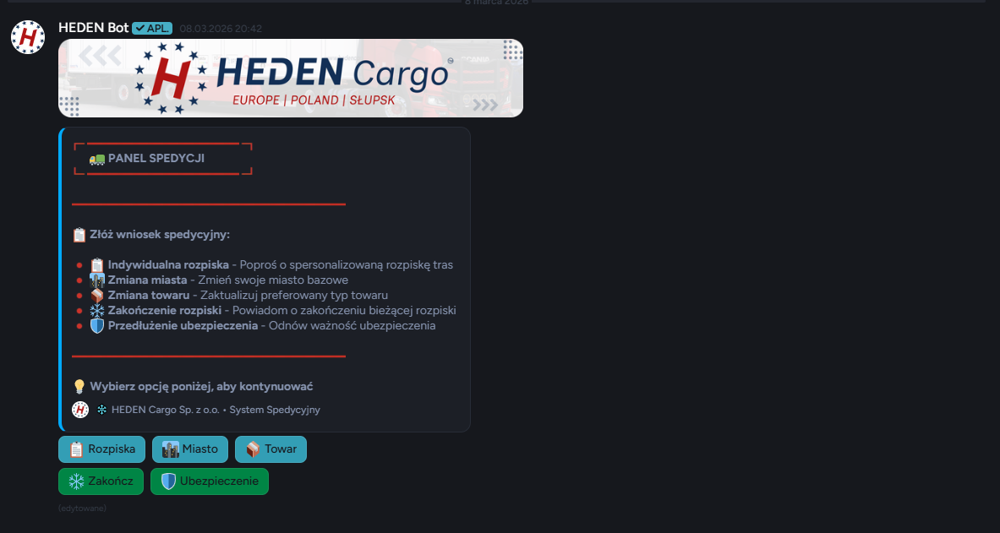
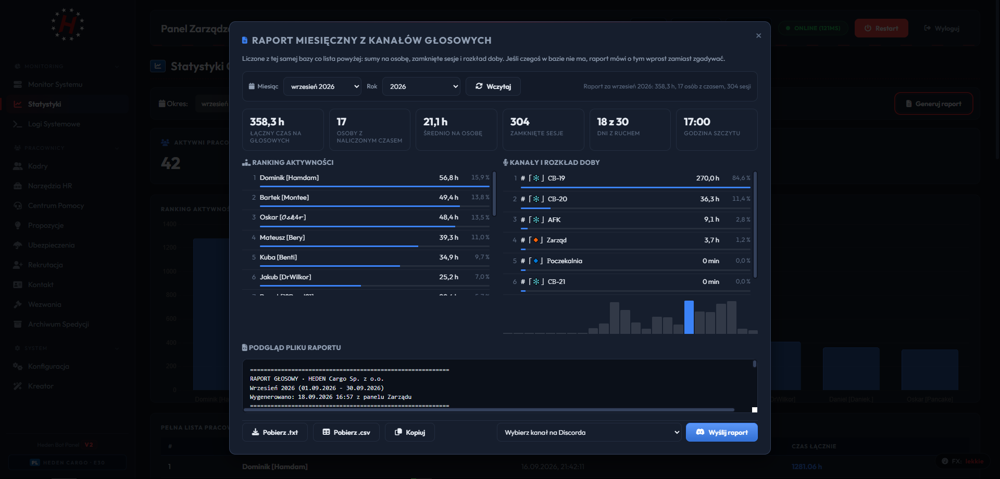

<div align="center">

# 🚚 HEDEN Cargo Web - Platforma Spedycyjna

[](https://nodejs.org/)
[](https://discord.js.org/)
[](https://expressjs.com/)
[](https://www.docker.com/)

[](https://discord.com/users/446740090757316608)
[](#-licencja)

<br>

### 🌐 Kompleksowa platforma spedycyjna HEDEN Cargo - strona internetowa + zaawansowany bot Discord

<br>

[🌐 Strona WWW](#-strona-internetowa) •
[🤖 Discord Bot](#-discord-bot) •
[📸 Screenshots](#-screenshots) •
[🛠️ Technologie](#️-technologie) •
[📞 Kontakt](#-kontakt)

<br>

---

</div>

<br>

## 🌐 Panel Zarządzania WWW

### �️ Web Dashboard do zarządzania botem i serwerem Discord

Nowoczesny panel administracyjny do zarządzania całym systemem HEDEN Cargo:

#### � Panel Administratora
- ✅ **Dashboard główny** - Przegląd statystyk serwera i bota
- ✅ **Zarządzanie użytkownikami** - Panel pracowników i uprawnienia
- ✅ **Konfiguracja bota** - Ustawienia i parametry systemu
- ✅ **Logi systemowe** - Szczegółowe logi działalności

#### 🎯 Zarządzanie Zleceniami
- ✅ **Panel zleceń** - Przegląd i zarządzanie zleceniami spedycyjnymi
- ✅ **Akceptacja wniosków** - Panel do zatwierdzania zleceń pracowników
- ✅ **Statusy zleceń** - Śledzenie statusów w czasie rzeczywistym
- ✅ **Raporty zleceń** - Generowanie raportów i statystyk

#### 👥 Zarządzanie Pracownikami
- ✅ **Awansy i zwolnienia** - System zarządzania rangami
- ✅ **Ostrzeżenia** - Panel kar i ostrzeżeń
- ✅ **Voice tracking** - Statystyki aktywności głosowej
- ✅ **Raporty miesięczne** - Automatyczne generowanie raportów

#### 🎤 Analityka i Statystyki
- ✅ **Voice analytics** - Szczegółowe statystyki voice channels
- ✅ **Heatmapy aktywności** - Wizualizacja obecności pracowników
- ✅ **Trendy użytkowania** - Analiza trendów aktywności
- ✅ **Export danych** - Eksport raportów do CSV/PDF

#### � Multimedia i Streamy
- ✅ **Panel streamerów** - Zarządzanie streamerami Twitch
- ✅ **Galeria zdjęć** - Zarządzanie fotoreportażami
- ✅ **Ogłoszenia** - System ogłoszeń firmowych
- ✅ **Multimedia** - Upload i zarządzanie mediami

---

## 🌐 Express API Bridge

### 🔗 Integracja z Systemem WWW HEDEN Cargo

Express API (port 6222) służące jako most między botem Discord a zewnętrznym systemem WWW:

#### 📡 API Endpoints
- ✅ **POST /new-mail** - Przekazywanie wiadomości z systemu WWW do Discord
- ✅ **POST /new-order** - Powiadomienia o nowych zleceniach z systemu spedycyjnego
- ✅ **POST /new-application** - Nowe wnioski z systemu WWW

#### 🌐 Integracja z Systemem WWW
- ✅ **CORS dla `http://128.140.124.163:4000`** - Bezpieczna komunikacja
- ✅ **Powiadomienia Discord** - Embed messages na kanały i DM
- ✅ **Linki do systemu** - `https://hedencargo-system.pl/` i `https://system.hedencargo.pl/`
- ✅ **Real-time sync** - Natychmiastowe powiadomienia o zdarzeniach

#### 🔄 Przepływ Danych
```
System WWW → Express API → Discord Bot → Kanały Discord
    ↓              ↓              ↓              ↓
Zlecenie → /new-order → Embed message → 🔻Spedycja
Wniosek → /new-application → DM do admina → Powiadomienie
Mail → /new-mail → DM do użytkownika → Wiadomość
```

---

## 🤖 Discord Bot

### 🚚 Bot do zarządzania firmą spedycyjną

Zaawansowany bot Discord integrujący społeczność z systemem zarządzania zleceniami:

#### 🎯 System Zleceń Spedycyjnych
- ✅ **Panel spedycji** - Przyciski do wniosków pracowniczych (🔺Spedycja)
- ✅ **Wnioski o zlecenia** - System składania wniosków transportowych
- ✅ **Akceptacja przez zarząd** - Panel zatwierdzania zleceń (🔻Spedycja)
- ✅ **Integracja API** - Powiadomienia z systemu WWW przez Express API

#### 👥 Zarządzanie Pracownikami
- ✅ **Panel pracowników** - Zarządzanie zespołem przez Discord
- ✅ **System awansów** - Podnoszenie i obniżanie rang pracowników
- ✅ **Ostrzeżenia** - System kar i ostrzeżeń dla pracowników
- ✅ **Raporty miesięczne** - Automatyczne generowanie raportów pracy

#### 🎤 Voice Tracking i Analityka
- ✅ **Śledzenie voice** - Automatyczne monitorowanie czasu na kanałach głosowych
- ✅ **Statystyki aktywności** - Szczegółowe statystyki obecności
- ✅ **Heatmapy** - Wizualizacja aktywności pracowników
- ✅ **Trendy** - Analiza trendów aktywności

#### 🎬 Streamy i Multimedia
- ✅ **Panel streamerów** - Ogłaszanie streamów Twitch (Alberto, Osk4r, Benti, Hamdam)
- ✅ **Powiadomienia LIVE** - Automatyczne ogłoszenia na kanale 🔴LIVE-ON
- ✅ **Fotoreportaże** - Galeria zdjęć z wydarzeń firmowych (📷Fotorelacja)
- ✅ **Multimedia** - Zarządzanie treściami na kanale 📷Fotorelacja

#### 🆘 System Wsparcia
- ✅ **Ticket system** - Rekrutacja i inne tematy (automatyczne kanały)
- ✅ **Propozycje pracowników** - System zgłaszania propozycji na kanale 🔺Propozycje
- ✅ **Pomoc techniczna** - Wezwania pracowników i wsparcie
- ✅ **Transkrypty** - Zapisywanie rozmów na kanale Transcrypt

#### 🔧 Automatyzacja Serwera
- ✅ **Panele interaktywne** - Automatyczne odświeżanie paneli (weryfikacja, ticket, spedycja)
- ✅ **Role i uprawnienia** - Zarządzanie rolami (Zarząd, Spedytor, Streamer, Fotograf)
- ✅ **Statystyki serwera** - Licznik użytkowników i ostatni członek
- ✅ **Backup system** - Automatyczne backupy bazy danych

#### 📡 Integracja Zewnętrzna
- ✅ **System WWW** - Integracja z hedencargo-system.pl i system.hedencargo.pl
- ✅ **API Bridge** - Express API (port 6222) do komunikacji z systemem
- ✅ **Powiadomienia zewnętrzne** - Przekazywanie wiadomości i zleceń
- ✅ **Real-time sync** - Synchronizacja zdarzeń między systemami

---

## 📸 Screenshots

### 🤖 Bot Discord w Akcji



*Interaktywne panele: spedycja, ticket, streamery, propozycje*

<br><br>

### 📡 Express API Bridge


*Endpointy /new-order, /new-mail, /new-application*

<br><br>

### 📊 Voice Tracking i Raporty



*Automatyczne raporty miesięczne z aktywności głosowej*

<br>

<br>

---

## 🎨 Przykładowe Logi Systemu

```
━━━━━━━━━━━━━━━━━━━━━━━━━━━━━━━━━━━━━━━━━━━━━━━━━
🚚 HEDEN Cargo Bot + Express API - Uruchamianie...
━━━━━━━━━━━━━━━━━━━━━━━━━━━━━━━━━━━━━━━━━━━━━━━━━
[OK] ✓ Express API uruchomiony na porcie 6222
[OK] ✓ Zalogowano jako HEDEN Cargo#1234
[INFO] Discord.js v14.8.0
[INFO] Serwer: HEDEN Cargo Sp. z o.o.
[INFO] MongoDB: Połączone
[API] 📡 Endpoints /new-mail, /new-order, /new-application aktywne
[TICKET] 🎫 System ticketów załadowany
[VOICE] 🎤 Voice tracking aktywny
[COMMAND] 🎯 Zarejestrowano 42 komendy slash
[OK] ✓ System gotowy do pracy!

[API] 📡 Otrzymano nowe zlecenie #045 z hedencargo-system.pl
[SPEDYCJA] 📋 Wysłano powiadomienie na kanał 🔻Spedycja
[VOICE] 🔊 Użytkownik 𝓓𝓻𝓦𝓲𝓵𝓴𝓸𝓻 dołączył (1h 23m)
[STREAM] 🔴 Streamer Osk4r rozpoczął transmisję na Twitch
[TICKET] 🎫 Nowy ticket rekrutacyjny #001
[API] 📧 Nowa wiadomość przekazana do użytkownika
[REPORT] 📊 Raport voice wygenerowany dla marca 2026
```

<br>

## 🛠️ Technologie

<div align="center">

### 📡 Express API Bridge
[](https://nodejs.org/)
[](https://expressjs.com/)
[](https://github.com/expressjs/cors)

### 🤖 Discord Bot
[](https://nodejs.org/)
[](https://discord.js.org/)
[](https://www.mongodb.com/)

</div>

### Stack Techniczny:

#### 📡 Express API Bridge (Port 6222)
- **Backend:** Node.js + Express.js
- **CORS:** Konfiguracja dla `http://128.140.124.163:4000`
- **Endpoints:** POST /new-mail, /new-order, /new-application
- **Integration:** Komunikacja z zewnętrznym systemem WWW
- **Real-time:** Natychmiastowe przekazywanie zdarzeń

#### 🤖 Discord Bot
- **Runtime:** Node.js 18+ z Discord.js 14
- **Baza Danych:** MongoDB 4.4+ (Atlas lub self-hosted)
- **Voice Tracking:** Integracja audio Discord + mongoose
- **Commands:** Slash commands + context menu + prefix commands
- **Events:** Guild members, voice states, interactions
- **Integracja:** Odbieranie zdarzeń z Express API

<br>

## 📁 Struktura Projektu

```
HedenCargoWeb/
├── 📡 Express API Bridge
│   ├── 📄 server.js           # Serwer Express (port 6222)
│   ├── 📄 package.json        # Zależności projektu
│   └── 📁 express_files/      # Pliki API
│       ├── controller.js      # Kontrolery endpointów
│       ├── router.js          # Routery API
│       └── mongo_schemas.js   # Schematy MongoDB
│
├── 🤖 Discord Bot
│   ├── 📄 index.js            # Główny plik bota (4977 linii)
│   ├── 📄 config.js           # Centralna konfiguracja bota
│   └── � src/                # (w pliku index.js)
│       ├── commands/         # Komendy slash bota
│       ├── events/           # Event handlery Discord
│       ├── models/           # Modele danych MongoDB
│       ├── services/         # Usługi bota (voice tracking)
│       └── utils/            # Funkcje pomocnicze
│
├── 📁 Konfiguracja
│   ├── 📄 .env                # Zmienne środowiskowe
│   ├── 📄 .env.example        # Wzorzec zmiennych
│   ├── 📄 .gitignore          # Git ignore
│   └── 📄 .prettierrc          # Konfiguracja Prettier
│
├── 📁 Dokumentacja
│   ├── 📄 README.md           # Ta dokumentacja
│   ├── 📄 LICENSE             # Licencja MIT
│   ├── 📄 BOT_COMMANDS.md     # Dokumentacja komend
│   └── 📁 screenshots/        # Zrzuty ekranu systemu
│
└── 📁 Development
    ├── 📄 package-lock.json   # Lock file
    ├── 📄 Dockerfile          # Konfiguracja Docker
    └── 📄 banner.png          # Banner projektu
```

<br>

## 💼 Dostępne na zamówienie

<div align="center">

### 🎯 Chcesz taką platformę dla swojej firmy?

<br>

| Pakiet | Opis |
|--------|------|
| 🤖 **Bot Only** | Discord bot + voice tracking + ticket system |
| 📡 **API Bridge** | Express API + integracja z systemem WWW |
| 🚚 **Professional** | Pełny system: Bot + API + integracje WWW |
| 🏢 **Enterprise** | Wsparcie 24/7 + hosting + custom features |

<br>

---

## 📞 Kontakt

<div align="center">

### Zainteresowany? Napisz do nas!

<br>

| Developer | Discord | GitHub |
|-----------|---------|--------|
| **𝓓𝓻𝓦𝓲𝓵𝓴𝓸𝓻** | [Wilkor#446740090757316608](https://discord.com/users/446740090757316608) | [@WilkorPLYT](https://github.com/WilkorPLYT) |
| **daniek.** | [daniek.#640502766959329282](https://discord.com/users/640502766959329282) | [@daniekdan](https://github.com/daniekdan) |

</div>

<br>

## 📄 Licencja

<div align="center">

🔒 **Closed Source - Wszelkie prawa zastrzeżone**

Ten projekt jest własnością autora. Kod źródłowy nie jest publicznie dostępny.

Nieautoryzowane kopiowanie, modyfikowanie lub dystrybucja jest zabroniona.

Autor: WilkorPLYT & Daniel [Daniek.]
Copyright © 2024-2026 HEDEN Cargo Sp. z o.o.

</div>

<br>

---

<br>

## 👨‍💻 Autorzy

<div align="center">

[](https://github.com/WilkorPLYT)

<br>

Stworzony z ❤️ przez **𝓓𝓻𝓦𝓲𝓵𝓪𝓭𝓸𝓻** & **daniek.** dla **HEDEN Cargo Sp. z o.o.**

<br>

| Developer | Discord | GitHub |
|-----------|---------|--------|
| 𝓓𝓻𝓦𝓲𝓵𝓴𝓸𝓻 | [](https://discord.com/users/446740090757316608) | [](https://github.com/WilkorPLYT) |
| daniek. | [](https://discord.com/users/640502766959329282) | [](https://github.com/daniekdan) |

<br>

---

<br>

**⭐ Jeśli podoba Ci się ten projekt, zostaw gwiazdkę! ⭐**

</div>

<br>

---

<div align="center">

Made with ❤️ | HEDEN Cargo © 2024-2026

</div>
